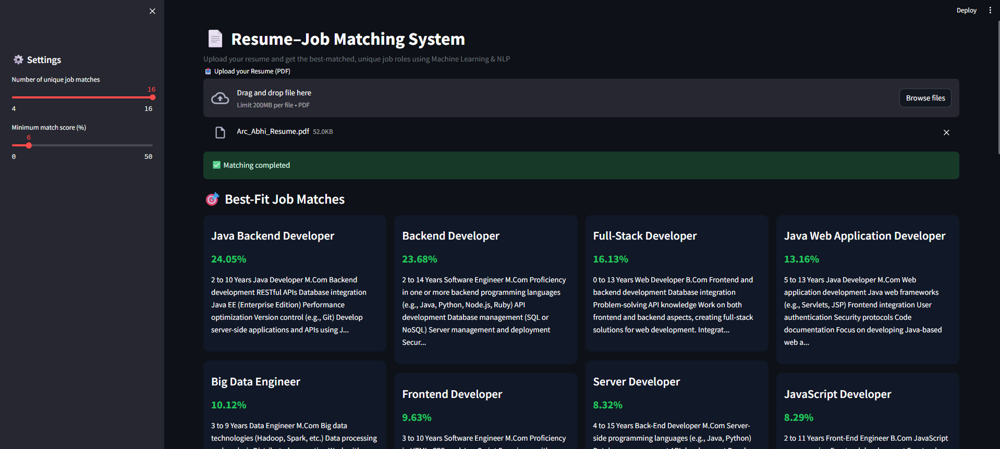
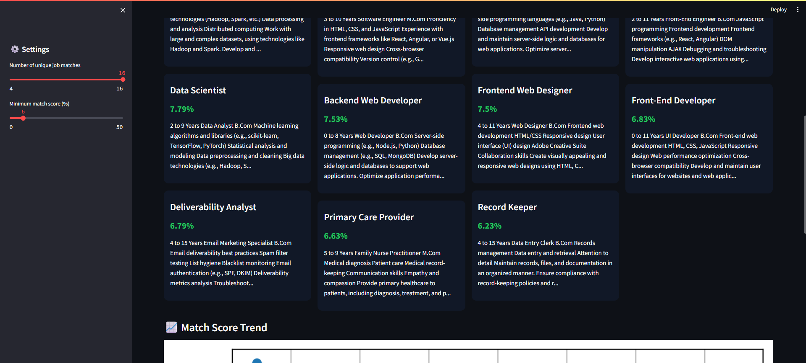
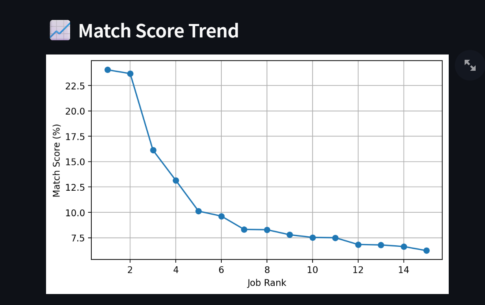

# 📄 Resume–Job Matching System (ML & NLP)

An end-to-end **Resume–Job Matching System** that analyzes a candidate’s resume and recommends the **best-fit job roles** using **Machine Learning and Natural Language Processing (NLP)**.

The system converts resumes and job descriptions into numerical representations using **TF-IDF vectorization** and ranks jobs based on **cosine similarity**.  
A clean **Streamlit web interface** allows users to upload resumes and instantly view job recommendations.

---

--- 

---

---

---

## 🚀 Key Features

- 📄 Upload resume in **PDF format**
- 🧠 ML-powered resume–job matching using **TF-IDF + Cosine Similarity**
- 🎯 **Unique, best-fit job roles** (duplicates removed)
- 📊 Match score (%) for each recommended job
- 🧩 4-column **grid-based professional UI**
- 📈 Visual **match score trend**
- ⚡ Fast inference using a **pickled ML model**

---

## 🧠 Machine Learning Approach

### 1. Text Representation
- Used **TF-IDF Vectorizer**
- Captures important skills and keywords
- Supports **unigrams and bigrams** (e.g., *machine learning*)

### 2. Similarity Measurement
- Used **Cosine Similarity**
- Measures how closely a resume matches each job description

### 3. Ranking Logic
- Jobs are ranked by similarity score
- Duplicate job roles are removed
- Only the **highest-scoring job per role** is shown

---

## 🛠️ Tech Stack

- **Python**
- **Scikit-learn**
- **Pandas / NumPy**
- **Streamlit**
- **pdfplumber**
- **Matplotlib**
- **Pickle**

---

